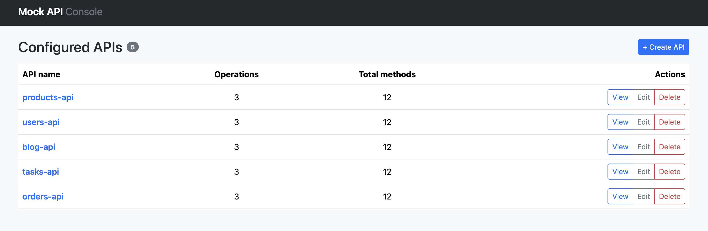

# mock-api-full

This project uses git subtree to include the `mock-api` and `mock-api-ui` projects as subdirectories.

- `mock-api-backend/` (the `mock-api` project) is a Spring Boot application that provides a mock API backend for testing and development purposes.
- `mock-api-frontend/` (the `mock-api-ui` project) is a React + TypeScript application that provides a UI to manage the mock API.

## Run the project with Docker

Important: Be sure your Docker is running, and you have the latest version of Docker Compose installed. 
For more information, see [DOCKER_CONFIG.md](./DOCKER_CONFIG.md)

```shell
# Build both images and start the stack in the background
docker compose up --build -d
```

- UI: http://localhost:8081
- Backend: http://localhost:8090 (change it with `BACKEND_PORT=9090 docker compose up --build -d`)

### 🚀 Features Preview



<details>
    <summary><b>📸 Click to view screenshot gallery</b></summary>
    <br>
    
    <hr>
    
    <hr>
    
</details>

## Pull changes from the projects

```shell
git subtree pull --prefix=mock-api-backend git@github.com:Joxebus/mock-api.git main --squash
git subtree pull --prefix=mock-api-frontend git@github.com:Joxebus/mock-api-ui.git main --squash
```

## Push changes to the projects

```shell
git subtree push --prefix=mock-api-backend git@github.com:Joxebus/mock-api.git main
git subtree push --prefix=mock-api-frontend git@github.com:Joxebus/mock-api-ui.git main
```

## Docs

- Mock API samples: [docs/mock-api-samples](./docs/mock-api-samples/README.md)
- Backend README: [mock-api-backend](./mock-api-backend/README.md)
- UI README: [mock-api-frontend](./mock-api-frontend/README.md)
- Docker Configuration: [DOCKER_CONFIG.md](./DOCKER_CONFIG.md)