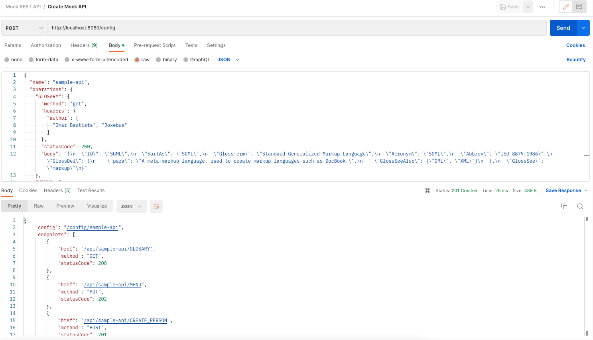
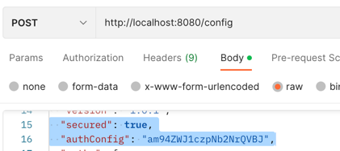
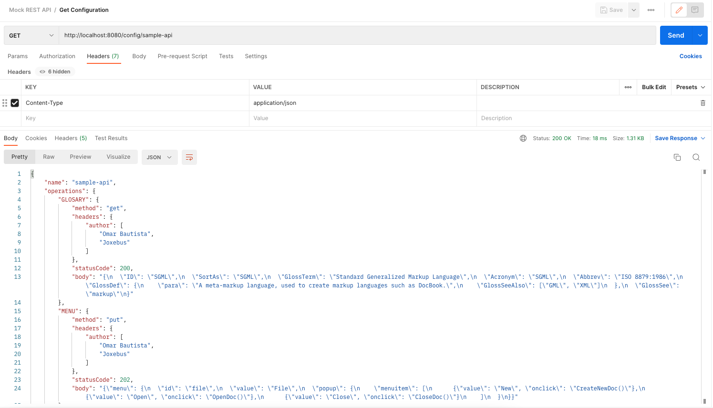
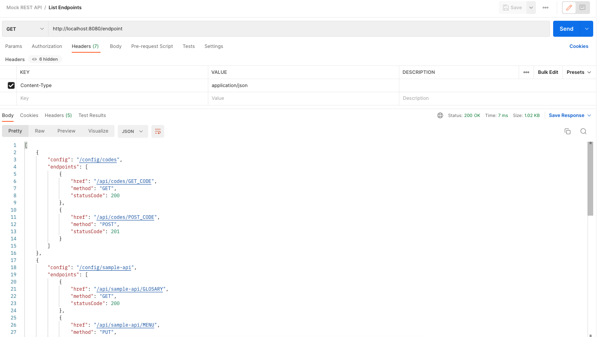
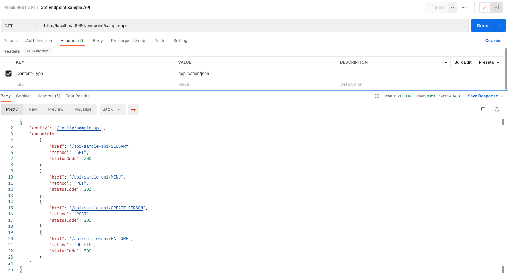
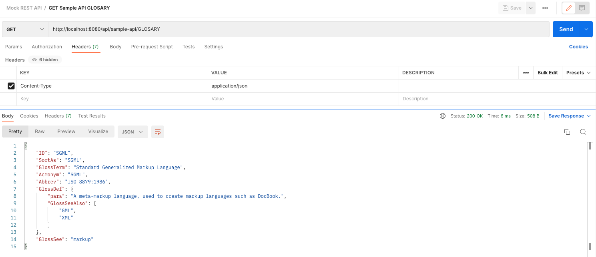
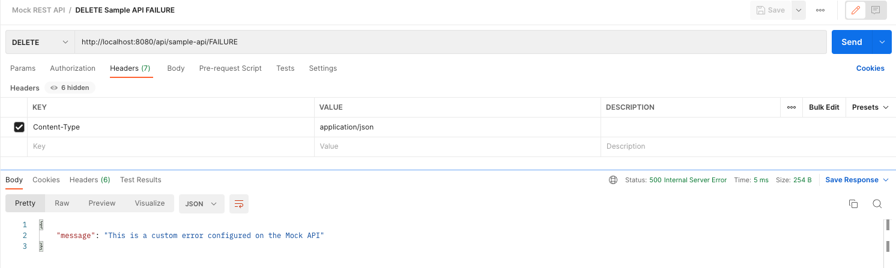

# How to use Mock REST API

Mock REST API provides some operations to interact with it. This application
read the configuration from files in your file system (for now!)

- `/config` 
  - `POST`: creates or updates an API configuration and saves it in **YAML** format,
  you can configure the directory in the **application.yaml** or with 
  an **env** variable called `FILES_UPLOAD_FOLDER`. The payload is validated before
  being saved (see [Validation](#validation)); an invalid configuration is rejected
  with `400 Bad Request` and is not persisted.
  - `GET`: returns the raw data of the API configured `/config/{apiName}`
  - `DELETE`: removes the configuration for `/config/{apiName}`. Returns `200 OK`
  when the configuration existed and was deleted, or `404 Not Found` when there is
  no configuration with that name.
- `/endpoint`
  - `GET`: **without** path variable will return the list of available endpoints of all APIs
  - `GET`: **with** path variable will return the endpoints for only selected API `/endpoint/{apiName}`
- `/api`
  - `GET | POST | PUT | DELETE | PATCH`: Method depends on the API configuration and each endpoint
  - `/api/{apiName}/{operation}`: As in the [sample-api.yaml](assets/samples/sample-api.yaml "API Configuration Sample")
  you can call for example `/api/sample-api/GLOSARY` and the method should match in the request.

### Configuration format

Under `paths`, **each operation name maps to a list of path definitions** (one entry per HTTP
method you want to expose on that operation). This is required — a single object instead of a
list will be rejected with a `400 Bad Request`.

```json
{
  "name": "sample-api",
  "version": "1.0.1",
  "secured": false,
  "paths": {
    "GLOSSARY": [
      {
        "method": "get",
        "headers": { "author": ["Omar Bautista"] },
        "statusCode": 200,
        "body": "{\"term\": \"SGML\"}"
      }
    ]
  }
}
```

The `contact` and `license` blocks are optional and may be omitted. When `secured` is `true`,
`authConfig` holds the expected value of the request's `Authorization` header. Each path entry's
`headers` are echoed back on the mocked response.

### Validation

`POST /config` validates the payload before saving it. If any of the rules below fail, the
request is rejected with `400 Bad Request` (with a message describing the problem) and nothing
is written to disk:

- `name` is required and must not be blank.
- `paths` must contain at least one operation.
- Each operation must map to a **non-empty list** of path definitions.
- Each path definition must have a non-blank `method` and a `statusCode` in the `100`–`599` range.
- When `secured` is `true`, `authConfig` is required and must not be blank.

### Postman Collection

A postman [collection](assets/samples/Mock_REST_API.postman_collection.json "Mock REST API Samples") has been provided, you can find it inside the `assets/samples` folder.

### Configure endpoints

Create API configuration


MockAPI support auth configuration, please refer to the Postman collection to see
the samples, when `secured` is set as true you need to specify the `Authorization` header on your
request with the password set on your configuration.




Show API configuration


### Show endpoints

List endpoints


Show specific endpoint


### Calling mocked API

Sample GET


Sample Custom Error
